```mermaid
sequenceDiagram
    participant User
    participant Browser
    participant MFLoader as mf-loader.js
    participant EdgeRouter as Edge Router
    participant SessionsKV as SESSIONS_KV
    participant TaskAPI as Task API Worker
    participant TasksKV as TASKS_KV

    Note over User,TasksKV: Initial Page Load with Key

    User->>Browser: Visit /task/?key=abc123def456
    Browser->>MFLoader: Load page
    MFLoader->>MFLoader: Extract key from URL
    MFLoader->>MFLoader: Determine userType (admin/friend/public)
    
    Note over MFLoader,SessionsKV: Session Creation (Key → SessionId)
    
    MFLoader->>EdgeRouter: POST /session/create<br/>{ key: "abc123def456" }
    EdgeRouter->>EdgeRouter: Generate sessionId = xyz789
    EdgeRouter->>SessionsKV: PUT session:xyz789 → abc123def456<br/>(expires 24h)
    EdgeRouter->>MFLoader: { sessionId: "xyz789" }
    
    Note over MFLoader,Browser: Mount Child App (No Key Exposed!)
    
    MFLoader->>Browser: mount(root, {<br/>  userType: "admin",<br/>  userId: "abc123def456",<br/>  sessionId: "xyz789"<br/>})
    
    Note over Browser,TasksKV: API Request (SessionId → Key Injection)
    
    Browser->>EdgeRouter: POST /task/api<br/>X-Session-Id: xyz789<br/>{ title: "New task" }
    EdgeRouter->>SessionsKV: GET session:xyz789
    SessionsKV->>EdgeRouter: abc123def456
    EdgeRouter->>EdgeRouter: Inject X-User-Key: abc123def456
    EdgeRouter->>TaskAPI: POST /task/api<br/>X-User-Key: abc123def456<br/>X-Session-Id: xyz789<br/>{ title: "New task" }
    TaskAPI->>TaskAPI: Authenticate via X-User-Key<br/>(check ADMIN_KEY/FRIEND_KEY)
    TaskAPI->>TasksKV: Save task
    TasksKV->>TaskAPI: OK
    TaskAPI->>EdgeRouter: 200 { id: "...", ... }
    EdgeRouter->>Browser: 200 { id: "...", ... }
    
    Note over User,TasksKV: Key Never Leaves Server!
    
    Note right of Browser: ✅ Browser only knows sessionId<br/>❌ Key never in client code<br/>✅ Edge router manages mapping<br/>✅ Sessions auto-expire
```

## Key Security Boundaries

### Client-Side (Browser)
- **Has**: sessionId (random identifier)
- **Has NOT**: actual key
- **Can do**: Make API requests with sessionId
- **Cannot do**: Impersonate without valid session

### Edge Router (Server)
- **Has**: sessionId ↔ key mapping in KV
- **Does**: Inject key into proxied requests
- **Enforces**: Session expiry (24h TTL)

### Task API (Server)
- **Has**: ADMIN_KEY and FRIEND_KEY secrets
- **Does**: Validate X-User-Key header
- **Returns**: Authenticated responses

## Attack Surface Analysis

### ❌ Blocked Attacks
1. **XSS key theft**: Key never in client code/localStorage
2. **Session hijacking**: Sessions expire, regenerate on new login
3. **Key enumeration**: SessionIds are random, don't leak key info
4. **CORS bypass**: Proper CORS on session endpoint only

### ⚠️ Potential Issues & Mitigations
1. **Session fixation**: Generate new sessionId on each login ✅
2. **Long session life**: 24h expiry, consider shorter for admin ⚠️
3. **No session revocation**: Add admin endpoint to invalidate 📝
4. **No rate limiting**: Add per-session limits 📝

### 🔒 Future Hardening
- [ ] HTTPS-only cookies instead of header-based
- [ ] Session binding to User-Agent/IP (optional)
- [ ] Audit log of session creation/usage
- [ ] Alert on suspicious session patterns
- [ ] Add CSRF tokens for state-changing operations
